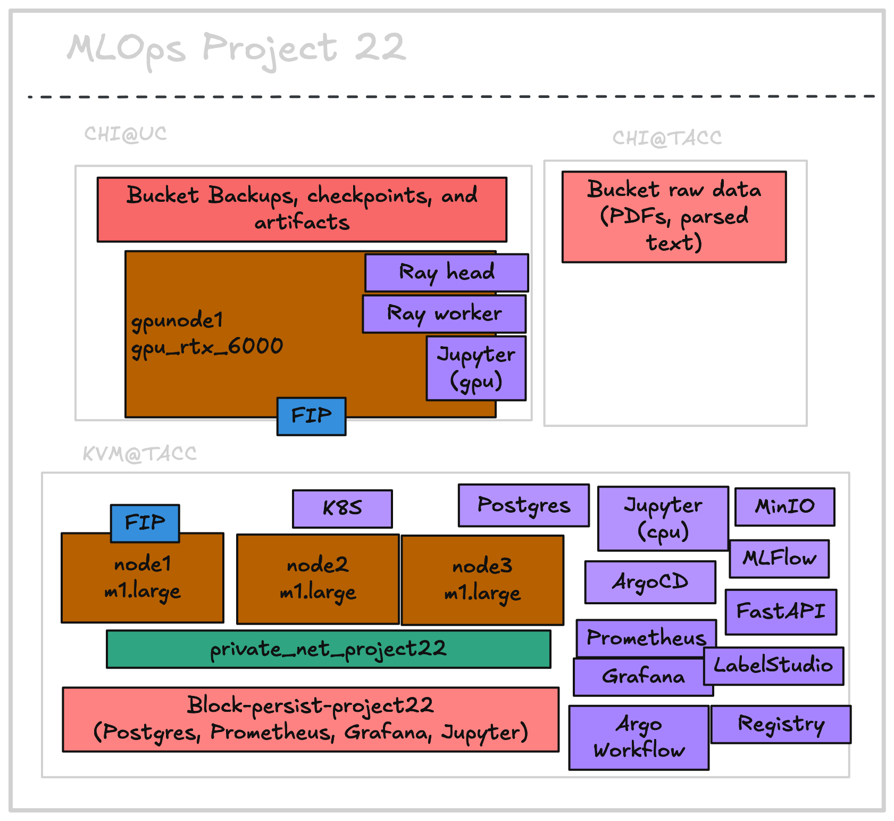

# Project Infrastructure

# To provision and bootstrap the infrastructure:

- Using Openstack CLI to create volumes and a reservation lease at [./openstack/README.md](./openstack/README.md).

- Using Terraform to bring up the infrastructure at [./terraform/README.md](./terraform/README.md) :
    - 3x m1.large cpu nodes at KVM@TACC site with a private network.
    - 1x RTX 6000 GPU node at CHI@UC site.

- Using Ansible to bootstrap the nodes with kubernetes, ArgoCD applications and setup secrets at [./ansible/README.md](./ansible/README.md) :
    - Add docker auth file ( `.docker` ) to the cpu and gpu nodes.
    - Bootstrap K8s on _both_ the nodes with kube-spray.
    - Create K8 namespaces and add secrets, and configMaps.
    - Bringing up ArgoCD applications.
    - Create a ssh tunnel from the gpu node at CHI_UC to node1 at KVM_TACC in order to access the Ray Cluster endpoint and metrics at KVM_TACC.

- Using Argo Workflows for automation.

# Kubernetes deployments

- [mlflow helm chart](./kubernetes/mlflow) serves the following apps:
    - mlflow
    - minio ( data persisted at chi_uc and chi_tacc object stores via csi drivers )
    - postgres ( storing chunks and embeddings persisted at block store )
    - labelstudio
    - jupyter ( notebooks persisted at block store )
    - prometheus ( logs persisted at block store )
    - grafana ( dashboards persisted at block store )
- [test model serving helm chart](./kubernetes/serve_testing)
    - fastapi app with onnx backend serving 2 models ( summarization model and embedding model ) ( 1 GPU )
- [staging helm chart](./kubernetes/serve_staging)
    - fastapi app with onnx backend ( 1 GPU )
- [canary helm chart](./kubernetes/serve_canary)
    - fastapi app with onnx backend ( 1 GPU )
- [production helm chart](./kubernetes/serve_prod)
    - fastapi app with onnx backend ( 1 GPU )
- [csi rclone drivers for kubernetes object storage class](./kubernetes/csi-rclone)
    - csi-rclone kubernetes storage class for object store volumes
- [gpu operator drivers for timeslicing gpu across pods](./kubernetes/gpu-operator)
- [ray cluster, 1 head and 2 workers ( 1 gpu per worker )](./kubernetes/kube-ray)
    - ray head node ( 4 cpus 8 GiB )
    - ray worker 1 ( 1 GPU, 8 CPUs and 16 GiB )
    - ray worker 2 ( 1 GPU, 8 CPUs and 16 GiB )
- Block store at KVM@TACC of 50 GB.
- Object store at CHI@UC :
    - ~100 GB of Block store backups, Model checkpoints from the Ray worker nodes, Caching models & pip packages for faster deployment of stages like - testing, staging, canary and production.
    - ~300 GB of raw arxiv pdfs, and processed text files.

