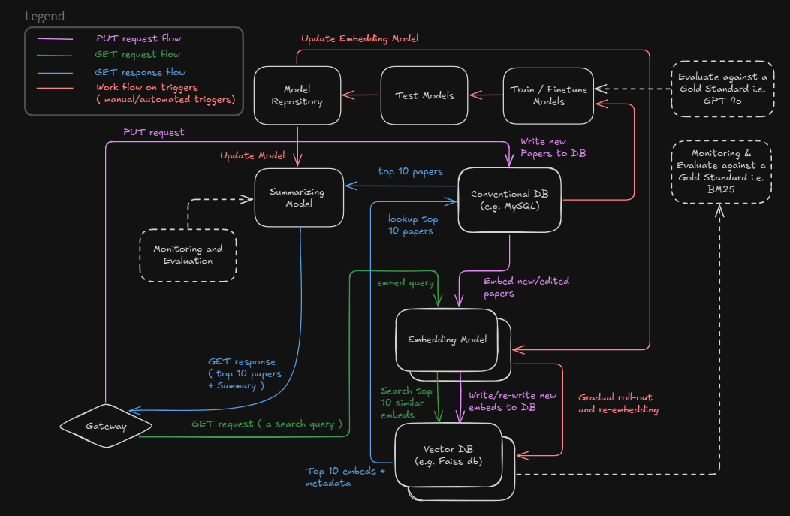

# Neura-Scholar

There are traditional search engines for papers like google Scholar which use indexing and word pair matching. While, our Machine Learning system ranks papers based on user query by using embedding model and Vector DB and also provides summaries.
The business metric to judge non ML systems with our ML system are click through rate and time taken to find desired result. 

### System diagram

